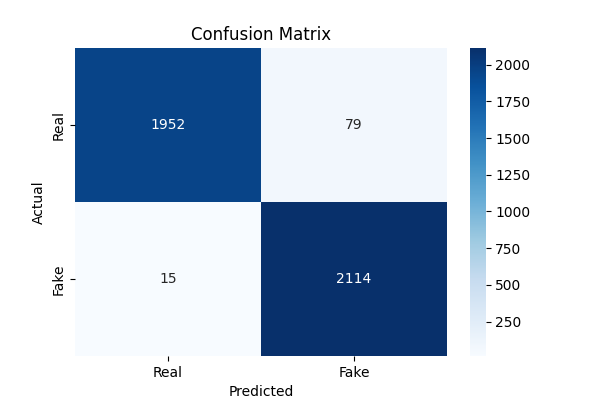

# 📰 Fake News Detection using Machine Learning (Logistic Regression)

This project is part of a **20-project hands-on series** designed to help newcomers **learn machine learning** through real-world applications. In this project, we build a simple yet powerful **Fake News Classifier** using **Logistic Regression**.

---

## 🚀 Project Goal

The goal of this project is to classify whether a given news article is **real or fake** based on its **author** and **title**. We use a machine learning model trained on labeled data to make predictions.

---

## 📚 Concepts Covered

This project teaches you the following core machine learning and NLP (Natural Language Processing) concepts:

| Concept               | Description                                                                 |
|-----------------------|-----------------------------------------------------------------------------|
| **Text Preprocessing** | Cleaning text (removing symbols, lowercasing, stemming, removing stopwords) |
| **Stopwords**         | Common words like *"the"*, *"is"*, *"and"* that are removed                 |
| **Stemming**          | Reducing words to their base form, e.g., *"running"* → *"run"*             |
| **TF-IDF Vectorization** | Converting textual data into numerical format using term frequency and inverse document frequency |
| **Train-Test Split**  | Splitting dataset into training and testing sets for validation             |
| **Logistic Regression** | A classification algorithm used to classify news as fake or real         |
| **Model Evaluation**  | Using `accuracy_score`, `confusion_matrix`, and `classification_report`     |

---

## 🛠️ Technologies Used

- Python 3.x  
- Pandas  
- NumPy  
- Scikit-learn  
- NLTK (Natural Language Toolkit)  
- Matplotlib + Seaborn (for visualizing confusion matrix)

---

## 🗂️ Project Structure

Fake-News-Detection/

│

├── train.csv # Dataset file with author, title, label

├── script.py # Main Python script

├── README.md # You're here!

---

## 📦 Installation and Setup

### 1. Clone the Repository
```bash
git clone https://github.com/yourusername/Fake-News-Detection.git
cd Fake-News-Detection
```

### 2. Install Required Libraries
```bash
pip install pandas numpy scikit-learn nltk matplotlib seaborn
```

### 3. Download NLTK Stopwords
You can either let the script do it, or run this manually:
```python
import nltk
nltk.download('stopwords')
```

### 4. Add Dataset
Ensure train.csv is present in the project root directory. It should contain the following columns:

- author
- title
- label (0 for real, 1 for fake)

---

## 🧠 How It Works

### 🔹 Data Preprocessing
- Null values filled with empty strings
- `content` column created by combining `author` and `title`
- Text cleaned using regex, lowercased, and stemmed
- Stopwords removed for clarity

### 🔹 Text Vectorization
- `TfidfVectorizer` used to convert text into numerical features

### 🔹 Model Training
- Data split into training and testing sets
- Logistic Regression model trained on vectorized text

### 🔹 Evaluation
- Accuracy, confusion matrix, and classification report used for performance measurement

### 🔹 Prediction
- Predicts if a given news item is real or fake

## 📈 Sample Output

```plaintext
Training Accuracy: 0.9873798076923077
Testing Accuracy: 0.9774038461538461

Classification Report:

              precision    recall  f1-score   support

        Real       0.99      0.96      0.98      2031
        Fake       0.96      0.99      0.98      2129

    accuracy                           0.98      4160
   macro avg       0.98      0.98      0.98      4160
weighted avg       0.98      0.98      0.98      4160

The news was --> 
   (0, 16226)	0.21368772495479132
  (0, 13917)	0.38203876070450216
  (0, 13046)	0.20921301668664005
  (0, 11388)	0.28611844518048735
  (0, 10920)	0.4582576533510953
  (0, 10495)	0.29929886439353304
  (0, 10315)	0.19571662606271853
  (0, 9645)	0.2820304429941274
  (0, 9161)	0.3471580521611571
  (0, 2729)	0.2643383881777287
  (0, 347)	0.2737344302051033 
 and the Expected label is --> 
 1
[1]
News is Fake
```
## 📊 **Confusion Matrix Visualization**  
The confusion matrix visually shows how well the model performs on both real and fake news classes.



## 🧪 Commands Summary

| Task                 | Command                                 |
|----------------------|-----------------------------------------|
| Install dependencies | `pip install -r requirements.txt` (optional) |
| Run the project      | `python script.py`                      |
| Download stopwords   | `nltk.download('stopwords')`            |
| Stem a sentence      | `porter.stem("running") → "run"`        |

## 📌 Notes for Newcomers

You can improve performance by:
- Using other models like `RandomForestClassifier` or SVM
- Improving text cleaning (e.g., lemmatization)
- Trying different vectorization techniques (like `CountVectorizer`, `Word2Vec`)
- Always evaluate on unseen data
- Don't forget to visualize results for better understanding

## 📚 Related Learning Projects in This Series

- Neural Networks ( Mask CNN )
- Image Processing Suprise
- Handwritten Digit Recognition
- Fake News Detection ✅ (this one)
- ...and 15 more to come!

## ✅ License

This project is open-source and available under the MIT License.

## 🙌 Contributing

Feel free to fork this repository and submit a pull request. All contributions, especially from beginners, are welcome!


